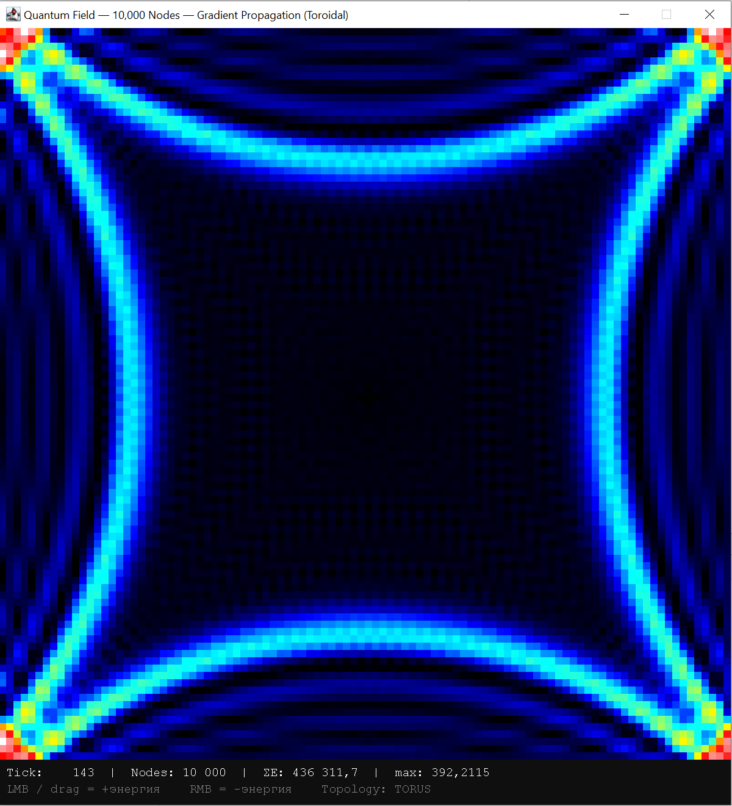
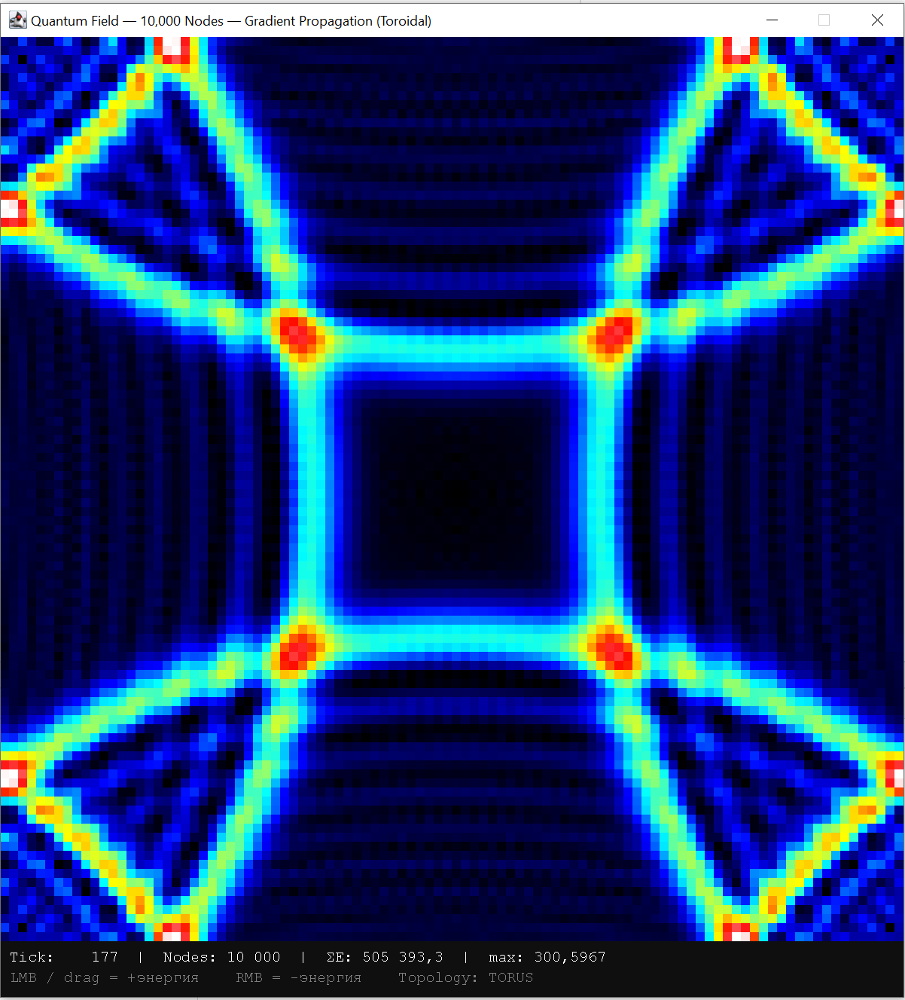
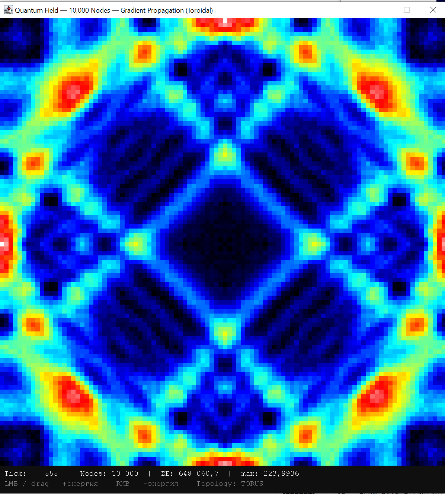
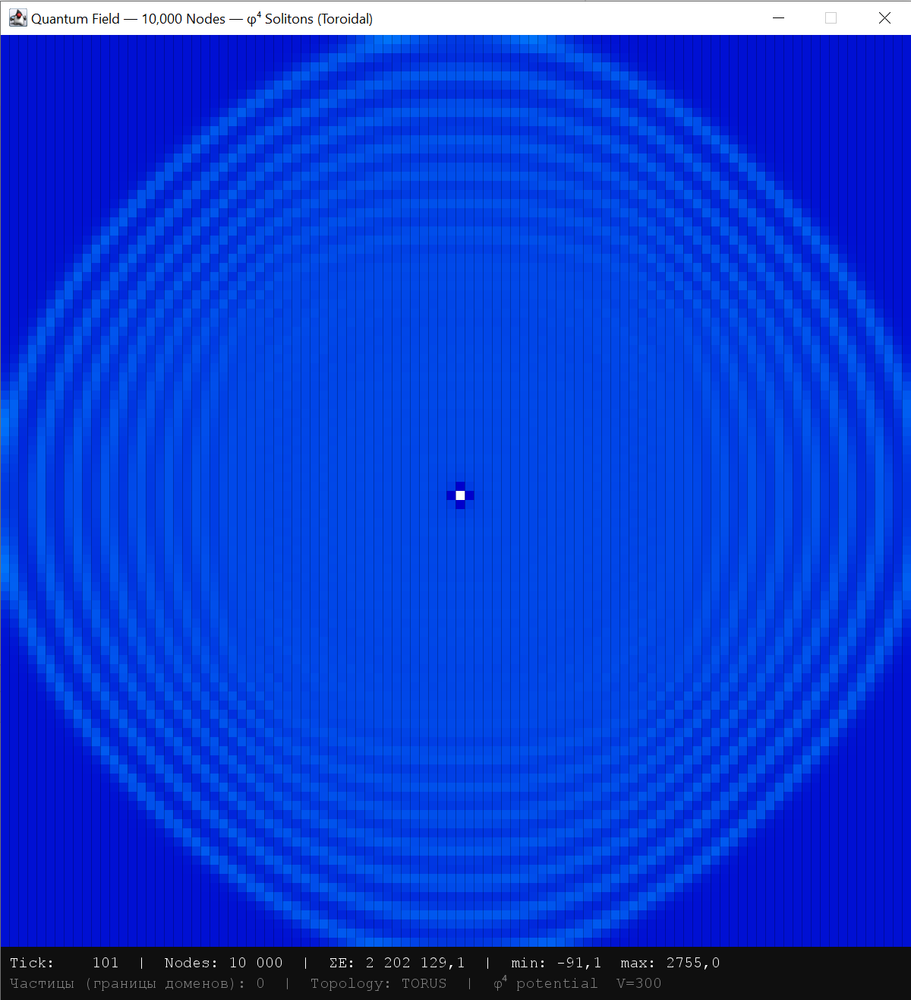
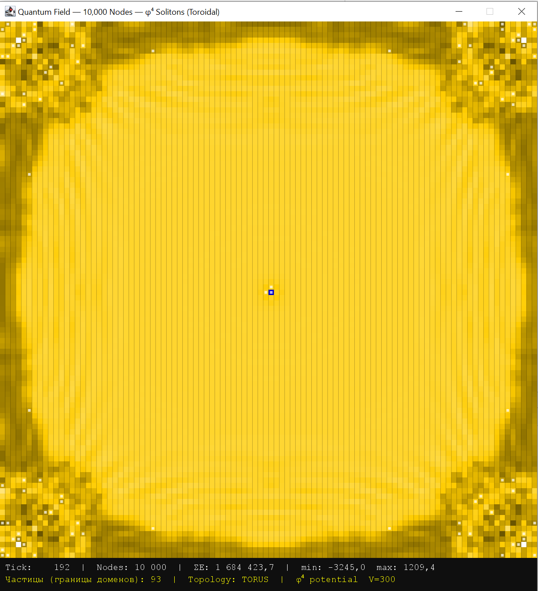

# Quantum Field Simulation — Документация


## Что это такое

Симуляция квантового поля на решётке 100×100 (10,000 узлов) с торической топологией.  
Написана на Java с визуализацией через Swing.

Каждый узел — это значение поля φ(x, y, t). Нет объектов, нет частиц как таковых.  
Частица — это **устойчивое возбуждение поля**, которое возникает само из правил.

---

## Структура проекта

```
src/main/java/ru/mcs/q/
├── Main.java                        # старый запуск (тетраэдры, 5 узлов)
├── TriangularBipyramidDemo.java     # 3D визуализация тетраэдров
├── VisualizationMain.java           # 3D поле с вращением
│
├── field/
│   ├── FaceColor.java               # цвета граней: RED, BLUE, GREEN, TRANSPARENT
│   ├── FaceState.java               # состояния грани: NEUTRAL, ATTRACTED, VIBRATING
│   ├── QuantumFieldMesh.java        # 2D сетка тетраэдров (оригинал)
│   ├── QuantumFieldMesh3D.java      # 3D сетка тетраэдров
│   ├── QuantumFieldVisualization.java # 3D рендер
│   ├── Tetrahedron3D.java           # узел с позицией, ориентацией, энергией
│   ├── Vector3D.java                # математика векторов
│   ├── Quaternion.java              # вращения
│   └── ProjectionUtils.java        # проекции: изо / перспектива / орто
│
└── grid/
    ├── GridField.java               # ← ЯДРО симуляции
    ├── GridVisualization.java       # ← визуализация тепловой картой
    └── GridMain.java                # ← точка запуска
```

---

## Как запустить

```bash
# Через Gradle
./gradlew :GridMain.main

# Или через IntelliJ IDEA — запустить GridMain.main()
```

---

## GridField.java — ядро

### Константы (можно менять)

| Константа | Значение | Смысл |
|-----------|----------|-------|
| `WIDTH`   | 100      | Ширина решётки |
| `HEIGHT`  | 100      | Высота решётки |
| `FLOW_RATE` | 0.20   | Скорость распространения волны. **< 0.25** — условие устойчивости |
| `DAMPING` | 0.998    | Затухание за тик. 1.0 = без потерь, 0.99 = быстрое затухание |
| `V`       | 300.0    | Положение вакуума ±V для потенциала φ⁴ |
| `LAMBDA`  | 0.000002 | Сила нелинейности. Больше = сильнее тянет к ±V |
| `MAX_PHI` | V × 20   | Ограничитель взрыва. Защита от NaN |

### Физическое уравнение

Каждый тик вычисляется:

```
velocity[y][x] = velocity[y][x] * DAMPING
               + FLOW_RATE * Laplacian(φ)
               - LAMBDA * (φ² - V²) * φ

φ[y][x] = φ[y][x] + velocity[y][x]
```

Где `Laplacian(φ) = φ_left + φ_right + φ_up + φ_down - 4·φ`  
Топология **торическая**: граница слева = граница справа, верх = низ.

### Режимы работы

**1. Чистое волновое уравнение** (LAMBDA = 0):
- Волны расходятся и интерферируют
- Тепловая смерть — равномерное размытие

**2. Волна + потенциал φ⁴** (LAMBDA > 0):
- Поле стягивается к вакуумам ±V
- На границах доменов возникают солитоны (частицы)
- Аннигиляция при столкновении противоположных доменов

### Ключевые методы

```java
field.excite(x, y, amount)   // добавить/убрать энергию в узел
field.start(tickMs)           // запустить симуляцию (tickMs = 50 → 20 тиков/сек)
field.stop()                  // остановить
field.getDisplay(x, y)        // прочитать текущее значение φ для рендера
field.getTotalEnergy()        // ΣE по всем узлам
field.getMaxEnergy()          // максимальное значение
field.getMinEnergy()          // минимальное значение (отрицательное в волновом режиме)
field.detectParticles()       // List<int[]> координат границ доменов
field.getTick()               // номер текущего тика
```

---

## GridVisualization.java — визуализация

### Управление

| Действие | Эффект |
|----------|--------|
| **ЛКМ** (клик / drag) | Добавить энергию +2000 в узел |
| **ПКМ** (клик / drag) | Убрать энергию −1000 из узла |

### Цветовая шкала (двухполярная)

```
Синий  → Голубой → Чёрный → Жёлтый → Белый
 −max                 0                +max
```

Чёрные зоны = нулевая амплитуда (узловые линии).  
Синие = отрицательная фаза (destructive interference).  
Белые = максимум положительной амплитуды.

### Инфо-панель (внизу)

```
Tick: 347 | Nodes: 10,000 | ΣE: 2 634 285.7 | min: -4259.4  max: 4322.5
Частицы (границы доменов): 222 | Topology: TORUS | φ⁴ potential  V=300
```

Счётчик **"Частицы"** — число узлов на границе доменов ±V.  
Если значение **чётное** — работает закон сохранения топологического заряда.

---

## Сценарии запуска (GridMain.java)

### Один источник (по умолчанию)
```java
field.excite(50, 50, 600.0);
```
Наблюдаем: волна → фазовый переход → хаос доменов → "тепловая смерть"

### Два источника — интерференция
```java
field.excite(35, 50, 600.0);
field.excite(65, 50, 600.0);
```
Наблюдаем: два кольца пересекаются → интерференционный паттерн (как опыт Юнга)

### Одна доменная стенка — чистый солитон
```java
for (int y = 0; y < GridField.HEIGHT; y++)
    for (int x = 0; x < GridField.WIDTH; x++)
        field.excite(x, y, x < 50 ? GridField.V : -GridField.V);
```
Наблюдаем: одна вертикальная стенка — один устойчивый солитон (= частица).  
Добавь ЛКМ справа — создай антисолитон. Они столкнутся и аннигилируют.





---

## Физические явления которые уже работают

| Явление | Где видно |
|---------|-----------|
| Волновое уравнение | Концентрические кольца от источника |
| Принцип Хюйгенса | Каждый узел — источник вторичной волны |
| Интерференция | Полосы при двух источниках |
| Торическая топология | Волна уходит за край и возвращается |
| Фазовый переход | Домены ±V после возбуждения |
| Рождение пар | Счётчик частиц растёт чётными числами |
| Аннигиляция | Счётчик падает при столкновении доменов |
| Стрела времени | Рост энтропии: порядок → хаос |
| Тепловая смерть | Финальное равномерное состояние |

---

## Следующие шаги (идеи)

- [ ] **Солитон как частица**: запуск с одной доменной стенкой, измерение скорости
- [ ] **Масса солитона**: E = mc² — измерить энергию стенки как функцию V и LAMBDA
- [ ] **Квантование**: добавить случайный шум → наблюдать спонтанное рождение пар
- [ ] **Заряд**: разные цвета для доменов +V→−V и −V→+V (частица vs античастица)
- [ ] **3D решётка**: расширить до 3D куба (100×100×100 = 1,000,000 узлов на GPU)
- [ ] **Тетраэдральная решётка**: заменить квадратную сетку на тетраэдры (6 соседей)



---

## Зависимости

```groovy
// build.gradle — только стандартная Java, никаких внешних зависимостей
plugins { id 'java' }
group 'ru.mcs.q'
version '1.0-SNAPSHOT'
```

Java 17+. Swing встроен в JDK.

---

*Симуляция создана за один день итеративного эксперимента.  
Из одного правила (дискретный Лапласиан) возникли: волны, интерференция,  
фазовые переходы, рождение и аннигиляция частиц, стрела времени.*
